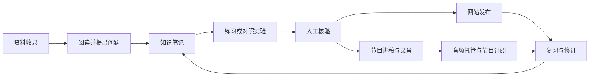

# AI 学习知识站与播客项目方案

建议建设一个可以持续维护的 AI 学习知识站：用 Markdown 保存资料卡、知识笔记、实验和学习路径，用 Astro 构建网站，用 GitHub 维护版本并通过 GitHub Pages 分享。音频播客复用已核验的文字内容，每期节目回链到相应笔记和实验。

重点是把学习积累成可查找、可复习、可验证的知识。收藏数量和更新频率作为辅助指标，首要产出是能够解释一个问题、完成一个实验并说明结论的适用边界。

这是原始设计方案。2026 年 10 月 3 日已实施文字站首版，可运行方式与当前限制见 README；本页的工期、内容节奏与后续阶段仍属于建议。技术能力与服务限制依据 2026 年 10 月 2 日查阅的官方文档。

## 使用范围与待定事项

暂定作者个人维护，以中文分享，面向有编程基础的 AI 学习者。首季围绕 AI 应用工程展开，同时补齐模型基础。项目位于 `/Users/bestx/vibecode/vibe-ai/ai-learning/`，单独建立 GitHub 仓库。

“播客”有两种可能含义：文字博客或知识站；包含音频节目的播客。方案共用同一知识库，保留音频发布设计。首版建议先完成知识站，再通过一期人工录音试播验证制作负担；若只需要文字博客，音频阶段可直接略过。

首次公开发布前需要确定 GitHub 账号和仓库、网站名称、署名及内容许可。启用音频时再确定节目形式、托管账号、节目封面和分发平台。这些选择不影响先整理内容和实施文字站。

## 学习与内容体系

网站提供三条入口：按主题查知识，按学习路径系统学习，按时间看近期笔记和节目。主题负责归类，路径负责前置关系，时间线负责追踪更新。

| 主题 | 核心问题 | 推荐产出 |
| --- | --- | --- |
| 基础 `foundations` | 数据、概率、向量、训练与推理分别解决什么问题 | 概念笔记与小练习 |
| 大模型 `llm` | token、上下文、注意力与模型能力边界如何理解 | 机制笔记与原始论文阅读 |
| 提示与输出 `prompting` | 如何表达任务并验证输出 | 提示对照实验 |
| 检索增强 `rag` | 怎样检索、引用与评估自己的资料 | 带测试集的小型检索项目 |
| 工具与智能体 `agents` | 工具调用、工作流和自主决策如何选择 | 工具调用与失败恢复实验 |
| 评估 `evaluation` | 怎样发现错误并比较改动 | 固定评测集与回归记录 |
| 工程化 `engineering` | 如何控制延迟、成本、权限和可观测性 | 可复现的工程案例 |
| 多模态 `multimodal` | 图像、音频与视频适合哪些任务 | 后续专题 |

每篇笔记只设一个主主题，另加少量具体标签，例如 `chunking`、`citation`、`tool-calling`。学习路径引用已有笔记，避免重新复制正文。实验和阶段复盘也放入笔记集合，通过 `kind` 区分。

## 学习流程



1. 收录时记下原始链接、作者、资料版本和收录原因；先判断它要解决哪一个学习问题。
2. 阅读后用自己的语言解释机制，区分来源事实、个人推断和未解决的问题。
3. 为关键结论做一个小练习或对照实验，保留运行条件、输入、结果与失败案例。
4. 核验来源和实验，整理成可以独立阅读的笔记；无法验证的结论明确标注。
5. 发布后安排建议的 1 天、7 天、30 天回顾，用不看原文的复述或练习检验理解。个人复习日期先记在私人工作区。

AI 助手可以整理提纲、提出复习题和帮助修改表达。引用链接、实验结果与最终结论由作者核验；正文说明 AI 协助范围。首版采用现有编辑工具完成这些辅助步骤。

## 内容模型与质量规则

建议使用四个 Astro 内容集合，统一通过 YAML frontmatter 描述元信息。Astro 支持本地 Markdown 内容集合及 schema 校验，适合这类结构化内容。[Astro 内容集合文档](https://docs.astro.build/en/guides/content-collections/)

| 集合 | 必要信息 | 关系 |
| --- | --- | --- |
| `resources` 资料卡 | slug、标题、类型、原始 URL、作者、访问日期、资料版本 | 被笔记的 `sources` 引用 |
| `notes` 笔记 | slug、标题、摘要、kind、主题、标签、状态、更新与核验日期 | 引用资料、前置笔记和相关笔记 |
| `tracks` 学习路径 | slug、标题、目标读者、前置要求、状态、有序步骤 | 每一步引用笔记 slug |
| `episodes` 节目 | slug、标题、摘要、状态、发布日期、关联笔记、音频地址、GUID | 回链笔记并关联托管节目 |

全站 slug 使用稳定的英文小写短横线形式，在各自集合内唯一；改标题时保持 slug，确需改变时安排旧地址迁移。关系字段引用对应集合的 slug，由构建校验确认目标存在。资料 `type` 建议取 `paper`、`doc`、`course`、`article`、`video`、`podcast` 或 `repo`。字段示例以模板为准，未来 schema 实现需匹配同一规范。

笔记 `kind` 取 `concept`、`lab` 或 `recap`；所有集合的状态使用 `draft`、`review`、`published`。只有 `published` 且发布日期不在未来的内容进入公开页面、列表、RSS、站点地图和搜索索引。公开内容不能引用未公开的笔记或资料卡。

发布笔记必须具备非空来源、最近核验日期和正文依据。实验笔记还要包含环境版本、复现步骤和实际结果。收录资料必须有有效原始链接；未知来源发布日期可留空。学习路径至少包含一个可访问步骤。发布节目必须关联已发布笔记并具有有效音频和托管标识。

字段完整只是第一道检查。人工审核还要检查断章取义、推断是否写成事实、是否真的跑过实验，以及内容是否有权公开。版本敏感笔记显示“最后核验日期”和所用软件、模型版本，默认每季度检查一次；出现重大版本变化时提前复查。

公开仓库中的 `draft` 文件依然可被阅读。未授权材料、私人摘录、账号和内部案例保存在仓库之外；公开资料卡只保存链接和自写摘要。代码与原创文字分别选择许可并说明第三方内容例外，首次发布时由作者确定具体许可。

## 网站结构与阅读体验

下列路由为站点内部路径。部署为 GitHub 项目站时，统一添加 `/ai-learning/` 前缀。

| 页面 | 路径 | 主要内容 |
| --- | --- | --- |
| 首页 | `/` | 项目定位、从这里开始、当前学习路径、最新笔记与节目 |
| 学习路径 | `/tracks/`、`/tracks/{slug}/` | 学习目标、前置知识、有序章节、每步验收任务 |
| 知识笔记 | `/notes/`、`/notes/{slug}/` | 主题筛选、摘要、正文目录、来源、前置与相关笔记 |
| 资料库 | `/resources/`、`/resources/{slug}/` | 按主题和资料类型筛选的精选资料卡 |
| 播客 | `/episodes/`、`/episodes/{slug}/` | 节目列表、播放器、时间轴、文字稿和关联笔记 |
| 主题 | `/topics/{topic}/` | 对应主题的路径、笔记、实验和节目 |
| 搜索 | `/search/` | 全文检索与主题过滤 |
| 关于 | `/about/` | 作者、内容方法、AI 使用说明、许可与纠错入口 |
| 文章订阅 | `/rss.xml` | 已发布知识笔记的文字 RSS |

建议采用简洁的阅读布局：桌面顶部导航、居中正文、侧边目录；手机单列正文和可展开目录。笔记页顶部展示问题、结论摘要、前置知识与核验日期，底部提供来源和下一篇学习内容。正文建议 18px、行高约 1.8、阅读宽度约 760px，以真实中文内容检查效果。

使用系统中文字体、浅色背景和单一强调色。交互保持键盘可用和清晰焦点，代码块允许横向滚动，音频提供文字稿并由读者主动播放。空列表显示明确提示；主题筛选和搜索均可清除条件。首版验收包含手机阅读和键盘操作。

## 技术架构

推荐 Astro 静态输出、TypeScript、普通 Markdown 和 CSS。页面以阅读和浏览为主，静态架构足以支持内容整理与分享；内容直接保存在 Git，减少运行服务和数据迁移的维护工作。

| 能力 | 实现选择 | 原因与约束 |
| --- | --- | --- |
| 内容与校验 | Astro Content Collections | 统一 schema 和内容引用规则 |
| 全文搜索 | Pagefind | 构建后生成静态搜索资源 |
| 文字订阅 | `@astrojs/rss` | 从已发布笔记生成 RSS |
| 页面与样式 | Astro 页面及 CSS | 以正文阅读为主，少量客户端交互 |
| 发布 | GitHub Actions 与 GitHub Pages | 主分支更新后自动构建并发布 |
| 音频与节目 RSS | 播客托管服务 | 集中管理音频、GUID、订阅与分发 |

Pagefind 在静态页面构建后索引；中文分词需要 extended 版本，并设置页面语言，例如 `zh-CN`。中文关键词和英文技术术语都应列入实际验收。[Pagefind 入门](https://pagefind.app/docs/)、[中文语言支持](https://pagefind.app/docs/multilingual/)

文字 RSS 使用 Astro 的 RSS 集成；音频订阅采用托管服务的节目 RSS，站内提供明确的两种订阅入口。[Astro RSS 文档](https://docs.astro.build/en/recipes/rss/)

实现目录如下。现已包含站点、校验、测试与部署配置，完整文件以仓库为准。

```text
ai-learning/
├── README.md
├── docs/                       # 方案与维护说明
├── templates/                  # 内容模板，不作为网站集合加载
├── src/
│   ├── content.config.ts       # 集合 schema 与加载规则
│   ├── content/
│   │   ├── resources/
│   │   ├── notes/
│   │   ├── tracks/
│   │   └── episodes/
│   ├── pages/                  # 上述页面与 rss.xml
│   ├── layouts/
│   ├── components/
│   └── styles/
├── public/images/              # 获准公开的压缩图片
├── scripts/                    # 发布质量与引用检查
├── .github/workflows/          # PR 检查与主分支部署
├── astro.config.mjs
└── package-lock.json
```

私人工作区放在该公开仓库之外。只从 `src/content/` 加载网站集合；发布前清空旧构建产物，再生成网站和 Pagefind 索引，避免撤下的文章残留。

## GitHub 维护与发布

默认创建公开仓库 `ai-learning`，以项目站地址 `https://<username>.github.io/ai-learning/` 分享。GitHub 用户名和现有个人站情况尚未知，这个方案便于以后从个人站链接过来。若确定直接使用个人站根地址，则采用 `<username>.github.io` 仓库并相应调整配置。

Astro 支持通过 GitHub Actions 部署到 GitHub Pages。项目站需要配置 `site` 和 `base`，并在 Pages 设置中选择 GitHub Actions。[Astro GitHub Pages 部署](https://docs.astro.build/en/guides/deploy/github/)

| 发布位置 | `site` | `base` |
| --- | --- | --- |
| 独立项目站 | `https://<username>.github.io` | `/ai-learning` |
| 用户个人站根地址 | `https://<username>.github.io` | `/` |
| 自定义域名 | 实际域名的 HTTPS 地址 | `/` |

链接、图片、搜索资源、canonical、站点地图和 RSS 统一通过站点配置生成路径，检查它们都包含正确前缀。避免把项目名写死在每一个组件中。

维护流程为：内容分支整理 → PR 审核 → 检查通过 → 合入主分支 → 自动部署。PR 只运行校验和构建，主分支负责 Pages 发布。单人维护也保留改动理由和来源记录；对已发布文章的小修订更新 `updatedAt`，不反复改首次发布日期。

建议的 PR 检查包括：内容 schema、slug 唯一性、引用完整性、公开状态过滤、占位内容检查、类型检查和生产构建。内部链接和资源路径在构建后检查。外部来源链接定期检查，遇到临时网络失败时记录待复查项。

首次部署需要仓库写权限、Pages 配置权限、Actions 可运行，以及当前受支持的 Node 版本。实施时锁定依赖和 Node 版本，提交 lockfile。域名属于后续选择。GitHub Free 可从公开仓库使用 Pages；实际额度以账号和平台政策为准。[GitHub Pages 限制](https://docs.github.com/en/pages/getting-started-with-github-pages/github-pages-limits)

## 音频播客制作与分发

建议一期围绕一个清楚的问题，时长目标 10 至 15 分钟：开场提出问题，解释核心机制，展示一个案例或实验，说明失败条件，最后给出复习任务。这个时长与结构是制作建议，先用一期试播调整。

节目制作流程为：选取已发布笔记 → 改写口语讲稿 → 核验技术用词与来源 → 录音及剪辑 → 上传播客托管 → 在站内发布节目笔记、时间轴和文字稿。第一版人工录音便于判断内容是否适合听；若选择 AI 配音，再验证技术词发音、声音授权、费用和节目平台要求。

音频托管服务作为音频和节目 RSS 的唯一维护来源。节目页面保留托管链接、可播放地址和稳定 GUID，不手工维护第二套节目 feed；发布时人工登记元信息即可，后续再考虑自动同步。网站或托管服务一侧改动后需检查链接对应同一期节目。

播客分发还需要平台账号和实际提交。例如 Apple Podcasts 要求公开可访问的 RSS、至少一期节目和节目封面，音频服务支持 HTTP HEAD 与字节范围请求；节目 enclosure 包含 URL、字节长度和 MIME 类型，每一期 GUID 应保持稳定。这些要求由托管服务承接，并在试播验收时核对。[Apple 播客 RSS 要求](https://podcasters.apple.com/support/823-podcast-requirements)

GitHub Pages 的站点大小上限为 1 GB，月带宽软限制为 100 GB，因此建议把持续增长的音频放在专门的托管服务。播客服务的价格、可导出能力与目标平台兼容性在选定音频形式后再核对。[GitHub Pages 容量与带宽限制](https://docs.github.com/en/pages/getting-started-with-github-pages/github-pages-limits)

## 首版交付与维护目标

首版已实现首页、学习路径、知识笔记、资料库、主题筛选、全文搜索、文字 RSS、关于页及 Pages 自动部署配置。首批内容已有 1 条路径、3 篇知识笔记、1 篇实验和 5 张资料卡；来源与实验已核对，作者公开发布前仍需通读，真实 Pages 线上部署待仓库地址确定后执行。

启用音频后增加节目列表和详情页，以 1 期真实节目验证播放、拖动进度、文字稿及订阅。知识站可以先上线，音频功能在没有实际节目时先不展示导航入口。

实施节奏、测试样例与首季选题见 [实施与学习路线](roadmap.md)。按每周 4 至 6 小时学习维护作为初始假设，争取每周完成一篇经过核验的笔记、每两周一次实验复盘；音频先双周一期，根据实际耗时调整。

成功标准是连续八周积累一条完整学习路径、能够复现的实验和可复用的知识总结。公开阅读量作为反馈参考。开发、写作和节目制作耗时分别记录，避免维护网站挤占学习时间。
